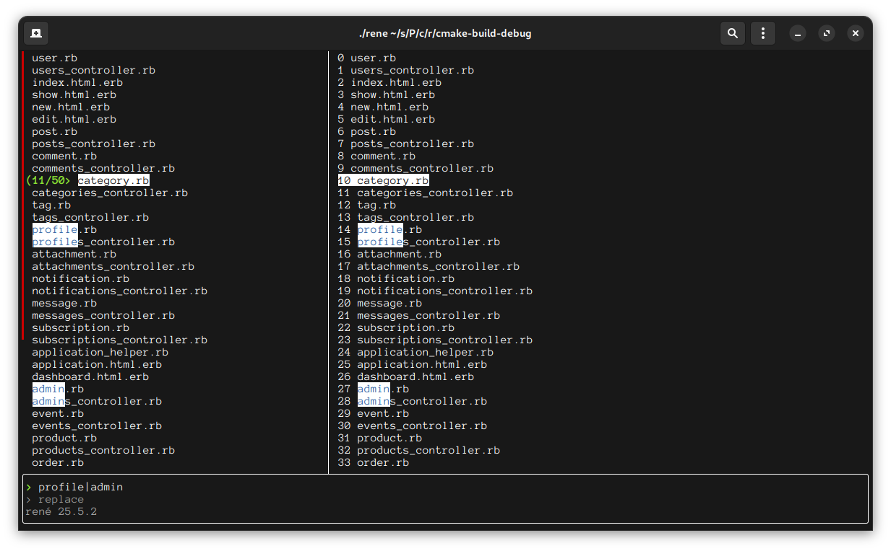

# Rene 

A command-line tool for bulk renaming files 

# Features 

- tbd

# Screenshots

# Milestones 

- [ ] Core Functionality - Basic cli structure and simple renaming operations
- [ ] Pattern Matching - Regex support and advanced filtering options
- [ ] Expression Engine - Custom syntax for complex renaming logic 
- [ ] Batch Operations - Configuration files and multi-directory processing 
- [ ] Advanced Features - Plugin architecture and metadata handling 
- [ ] User Experience - Improved output and usability features 
- [ ] Performance Optimization - Parallel processing and efficiency improvements 

# License 

This project is licensed under the [MIT License](https://mit-license.org/).